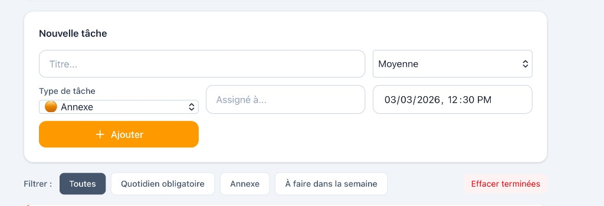
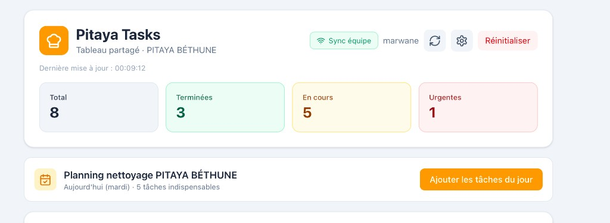
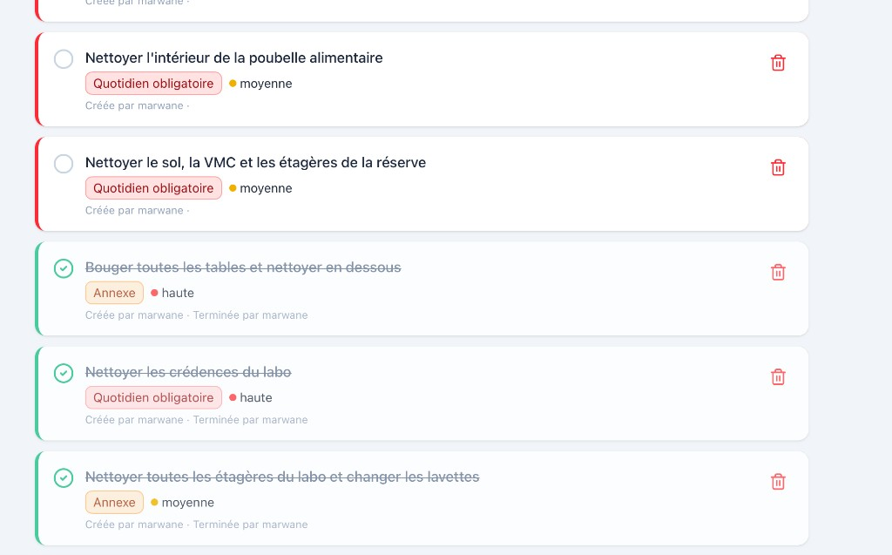

# Rapport de projet — Pitaya Tasks

**Application de gestion des tâches partagée — PITAYA BÉTHUNE**

---

## 1. Présentation du projet

**Pitaya Tasks** est une application web qui permet à l’équipe du restaurant **PITAYA BÉTHUNE** de gérer les tâches de nettoyage et d’organisation au quotidien. Il s’agit d’un **tableau de bord partagé** : tous les managers voient et modifient la **même liste de tâches** en temps réel, depuis leur téléphone ou leur ordinateur, sans installation d’application.

**Objectifs :**
- Centraliser les tâches indispensables et annexes sur un seul outil.
- Permettre à plusieurs personnes de suivre l’avancement et de cocher les tâches réalisées.
- Synchroniser les données entre tous les appareils (sync équipe).
- Utiliser un code couleur et des alertes pour prioriser le travail.

---

## 2. Ce que fait l’application (fonctionnalités)

### 2.1 Trois catégories de tâches

L’application distingue **trois types de tâches** avec un **code couleur** :

| Type | Couleur | Rôle |
|------|---------|------|
| **Quotidien obligatoire** | Rouge | Tâches à faire chaque jour (nettoyage, réserve, labo, etc.). |
| **Annexe** | Orange | Tâches supplémentaires ou ponctuelles. Si non faites, elles réapparaissent le lendemain. |
| **À faire dans la semaine** | Vert | Tâches à réaliser dans la semaine, sans obligation journalière. |

Formulaire « Nouvelle tâche » (titre, priorité, type de tâche, assigné à, date/heure) et filtres par type (Toutes, Quotidien obligatoire, Annexe, À faire dans la semaine).

### 2.2 Tableau de bord et statistiques

En haut de l’écran, l’utilisateur voit en un coup d’œil :
- **Total** : nombre total de tâches.
- **Terminées** : tâches cochées comme réalisées.
- **En cours** : tâches restant à faire.
- **Urgentes** : tâches marquées prioritaires (priorité haute).

### 2.3 Planning nettoyage PITAYA BÉTHUNE

Un bloc **« Planning nettoyage PITAYA BÉTHUNE »** affiche le jour actuel (ex. « Aujourd’hui (mardi) ») et le nombre de **tâches indispensables** du jour. Un bouton **« Ajouter les tâches du jour »** permet d’ajouter en un clic toutes les tâches prévues pour ce jour dans la liste (planning défini par jour : lundi, mardi, etc., sauf samedi).

### 2.4 Synchronisation équipe

Quand la synchronisation est activée (via Supabase), un badge **« Sync équipe »** apparaît en haut à droite. Tous les managers qui ouvrent le **même lien** (partagé par l’équipe) voient la **même liste** à jour : les tâches créées, cochées ou supprimées par l’un sont visibles pour les autres. Aucune configuration n’est demandée sur chaque téléphone ou ordinateur si l’administrateur a configuré une fois l’application sur Vercel.

### 2.5 Alertes et rappels

- **Rappel fin de journée** : à partir de 18 h, si des tâches ne sont pas réalisées, une bannière alerte l’utilisateur (« Rappel fin de journée : X tâche(s) non réalisée(s) ») avec un bouton « J’ai compris » pour la fermer.
- **Report des tâches annexes** : les tâches de type « Annexe » non faites sont automatiquement reportées au jour suivant, afin qu’elles réapparaissent dans la liste.

### 2.6 Gestion des tâches

- **Création** : formulaire « Nouvelle tâche » avec titre, type (Quotidien / Annexe / Semaine), priorité (basse, moyenne, haute), option « Assigné à », date/heure si besoin.
- **Filtres** : boutons pour afficher « Toutes » les tâches, ou uniquement « Quotidien obligatoire », « Annexe », « À faire dans la semaine ».
- **Cocher / Terminer** : clic sur le cercle à gauche de la tâche pour la marquer comme terminée (avec enregistrement de qui l’a terminée).
- **Suppression** : icône poubelle à droite de chaque tâche pour la supprimer. Bouton « Effacer terminées » pour supprimer en une fois toutes les tâches déjà cochées.

---
